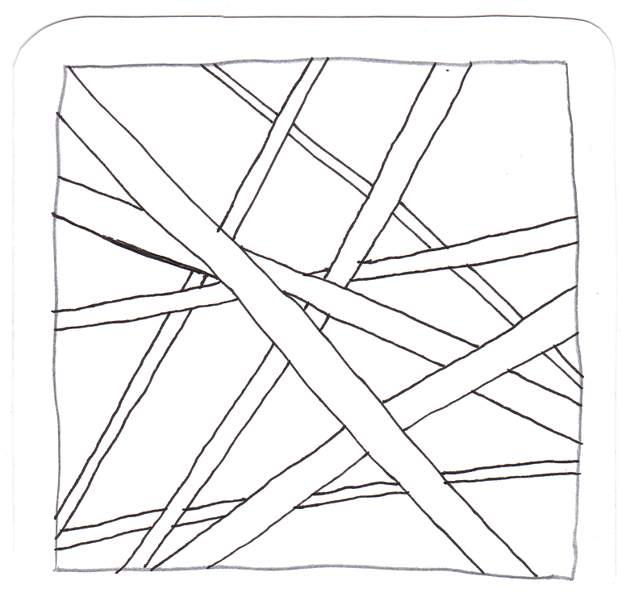

# Datenformate

Daten sind nicht gleich Daten - sie liegen in ganz unterschiedlichen Formen vor (Kapitel 3). Je nachdem, ob es sich um Zahlen, Zeichenketten oder Wahrheitswerte handelt,
werden Daten durch unterschiedliche *Datentypen* repräsentiert  (Kapitel 3.1).
Zusammenestellungen von Daten in der Form von Datensätzen werden in spezifischen *Datenformaten* erfasst - dazu zählen Textformate (Kapitel 3.2), Tabellenformate (Kapitel 3.3), Auszeichnungssprachen (Kapitel 3.4),
Objektdatenformate (Kapitel 3.5) oder Datenbanken (Kapitel 3.6). Welche Bedeutung diese Daten haben, wird schließlich über das *Datenmodell* festgelegt (Kapitel 3.7).

## Dateien in diesem Ordner

Bestimmen Sie die Datenformate in den Unterordnern und prüfen Sie so Ihr Wissen!

- **[3_3_tabellenformate](3_3_tabellenformate)**: CSV-Dateien in unterschiedlichen Dialekten.
- **[3_7_datenmodelle](3_7_datenmodelle)**: Unterschiedliche Varianten, ein und den gleichen Film zu erfassen.


## Datenformate im Vergleich

Die folgenden Beispiele enthalten immer die gleichen Daten, allerdings in unterschiedlichen Formaten. Überlegen Sie: für welchen Anwendungsfall ist welches Format geeignet?

**Tabelle**
<table style="width:100%">
<tr>
	<th>id</th>
	<th>name</th>
	<th>from</th>
	<th>favorites</th>
	<th>replies</th>
	<th>retweets</th>
	<th>hashtags</th>
</tr>
<tr>
	<th>6</th>
	<th>eaduenergy</th>
	<th>Forschungslabor Eadu</th>
	<th>64</th>
	<th>0</th>
	<th>1</th>
	<th>sternzerstörer,werft</th>
</tr>
<tr>
	<th>7</th>
	<th>eaduenergy</th>
	<th>Forschungslabor Eadu</th>
	<th>3</th>
	<th>0</th>
	<th></th>
	<th>todesstern</th>
</tr>
<tr>
	<th>8</th>
	<th>eaduenergy</th>
	<th>Forschungslabor Eadu</th>
	<th>30</th>
	<th>0</th>
	<th>6</th>
	<th>kyber</th>
</tr>
</table>


**CSV**  
<br>id,name,from,favorites,replies,retweets,hashtags
<br>6,eaduenergy,Forschungslabor Eadu,64,0,1,"sternzerstörer,werft"
<br>7,eaduenergy,Forschungslabor Eadu,3,0,,todesstern
<br>8,eaduenergy,Forschungslabor Eadu,30,0,6,kyber


**HTML**
```
<!DOCTYPE html>
<html>
  <head>
     <title>Tabelleninhalte</title>
  </head>  
  <body>
	<table style="width:100%">
		<tr>
			<th>id</th>
			<th>name</th>
			<th>from</th>
			<th>favorites</th>
			<th>replies</th>
			<th>retweets</th>
			<th>hashtags</th>
		</tr>
		<tr>
			<th>6</th>
			<th>eaduenergy</th>
			<th>Forschungslabor Eadu</th>
			<th>64</th>
			<th>0</th>
			<th>1</th>
			<th>sternzerstörer,werft</th>
		</tr>
		<tr>
			<th>7</th>
			<th>eaduenergy</th>
			<th>Forschungslabor Eadu</th>
			<th>3</th>
			<th>0</th>
			<th></th>
			<th>todesstern</th>
		</tr>
		<tr>
			<th>8</th>
			<th>eaduenergy</th>
			<th>Forschungslabor Eadu</th>
			<th>30</th>
			<th>0</th>
			<th>6</th>
			<th>kyber</th>
		</tr>
	</table>
   </body>
</html>
```


**JSON**  
```
[   
    {    
      "id": 6,
	  "name": "eaduenergy",
	  "from": "Forschungslabor Eadu",
	  "favorites" : 64,   
	  "replies" : 0,    
	  "retweets": 1,   
	  "hashtags": "sternzerstörer,werft"  
    },  
    {    
      "id": 7,
	  "name": "eaduenergy",
	  "from": "Forschungslabor Eadu",
	  "favorites" : 3,   
	  "replies" : 0,    
	  "retweets": 0,   
	  "hashtags": "todesstern"  
    },  
    {    
      "id": 8,
	  "name": "eaduenergy",
	  "from": "Forschungslabor Eadu",
	  "favorites" : 30,   
	  "replies" : 0,    
	  "retweets": 6,   
	  "hashtags": "kyber"  
    }
]  
```
