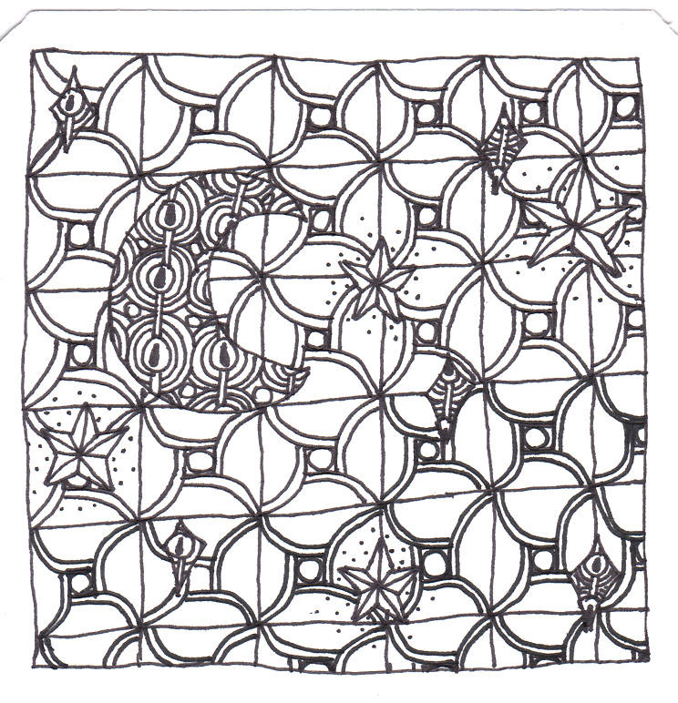

# Scaling Up

- Im Ordner 6_3_parallelisierung finden Sie Docker- und Vagrant-Dateien.
- Im Ordner 6_4_parallelisierung finden Sie Materialien, um Programme auf dem eigenen Computer oder auf einem HPC zu parallelisieren.