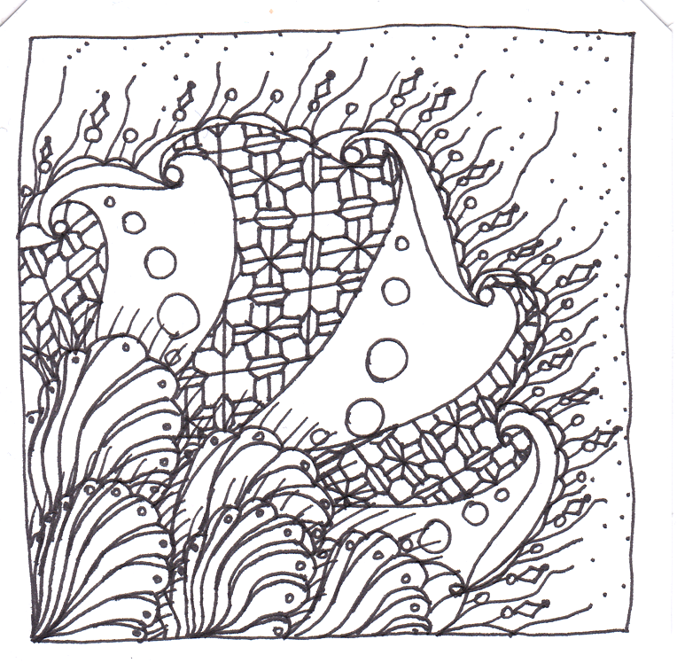

# Automatisierte Textanalyse

Automatisierte Textanalyse hilft dabei, Sprache formal zu analysieren. Dabei gibt es unterschiedliche Techniken:
- Wortfrequenzanalysen betrachten einzelne Wörter, deren Häufigkeiten, Kontexte und Kookkurrenzen (Kapitel 9.1),
- Diktionärsbasierte Inhaltsanalysen ziehen Wörterbücher für die Analyse heran, um die Wörter um Bedeutungen (beispielsweise eine Bewertung, wie positiv oder negativ ein Wort ist) zu ergänzen (Kapitel 9.2),
- Wenn Texte geparsed werden, kann man deren Syntax und Semantik analysieren, etwa durch Part-Of-Speech-Tagging oder Dependenzbäume. Word-Embeddings erschließen die Semantik von Wörtern (Kapitel 9.3).

Eine Einführung in die verschiedenen Techniken der automatisierten Textanalyse bietet Kapitel 9 im Lehrbuch.

## Dateien in diesem Ordner
- **[textanalyse.Rproj](textanalyse.Rproj)**: R-Projekt für die Beispiele
- **[1_textanalyse.R](1_textanalyse.R)**: R-Skript mit Befehlen zur Analyse von Korpora mit Funktionen aus dem tidyverse-Package (Kapitel 9.1)
- **[2_quanteda.R](2_quanteda.R)**: R-Skript für die Textanalyse mit dem Package quanteda (Kapitel 9.1)
- **[3_sentimentanalyse.R](3_sentimentanalyse.R)**: R-Skript mit Befehlen zur Sentimentanalyse mit SentiWS (Kapitel 9.2)
- **[4_spacy.R](4_spacy.R)**: R-Skript mit Befehlen aus dem Package spacy (Kapitel 9.3)
- **[korpus/beispielkorpus.zip](korpus/beispielkorpus.zip)**: Beispielkorpus, als Zip-Datei komprimiert. Damit die R-Skripte durchlaufen, entzippen Sie die Datei im Unterordner "korpus".
- **[docs](docs)**: Unterordner mit den Dokumentationen der POS-Tags
- **[sentiws](sentiws)**: Unterordner mit dem SentiWS-Diktionär

Das Beispielkorpus enthält 77 kurze Reflexionstexte von Studierenden im ersten Semester zu der Frage:
> Bei der Nutzung von Google, YouTube, WhatsApp oder anderen Internetdiensten fallen Daten an. Einige dieser Daten werden auch an Dritte weitergegeben. Was denken Sie, was mit Ihren Daten alles passiert? Wie würden Sie die Weitergabe von Daten bewerten? Was sollte aus Ihrer Sicht erlaubt sein und was nicht?
