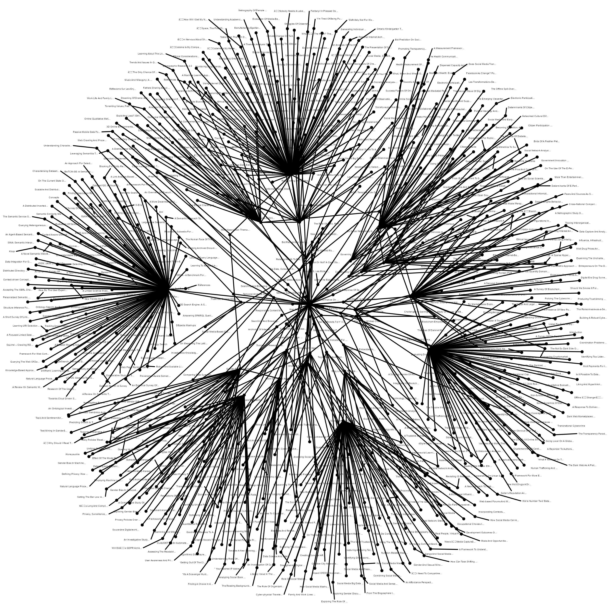
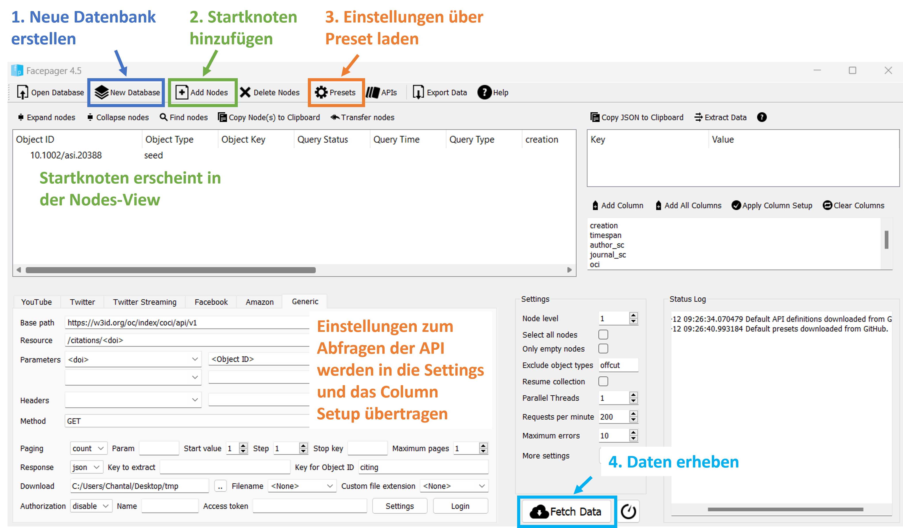
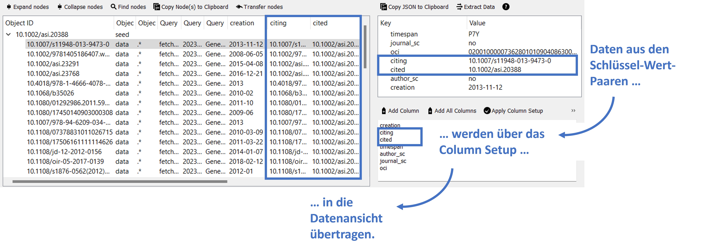
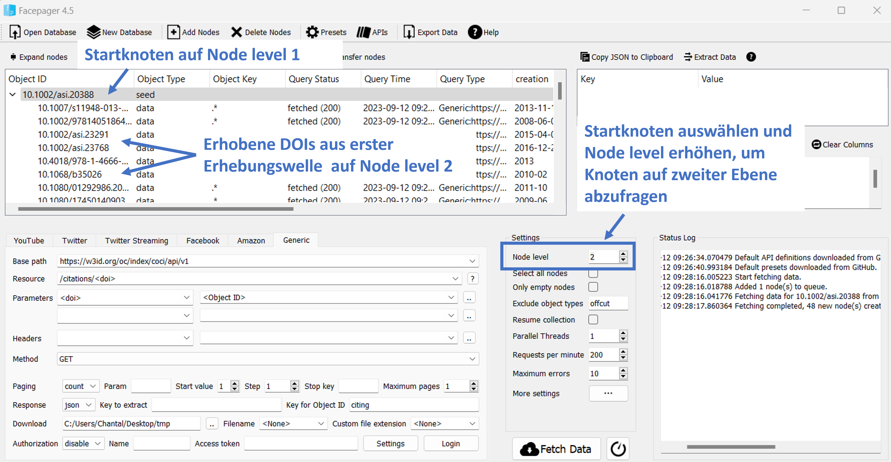
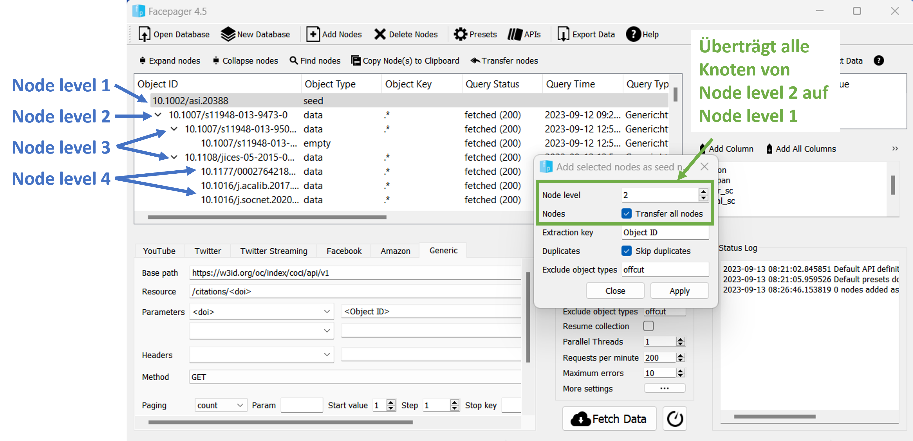
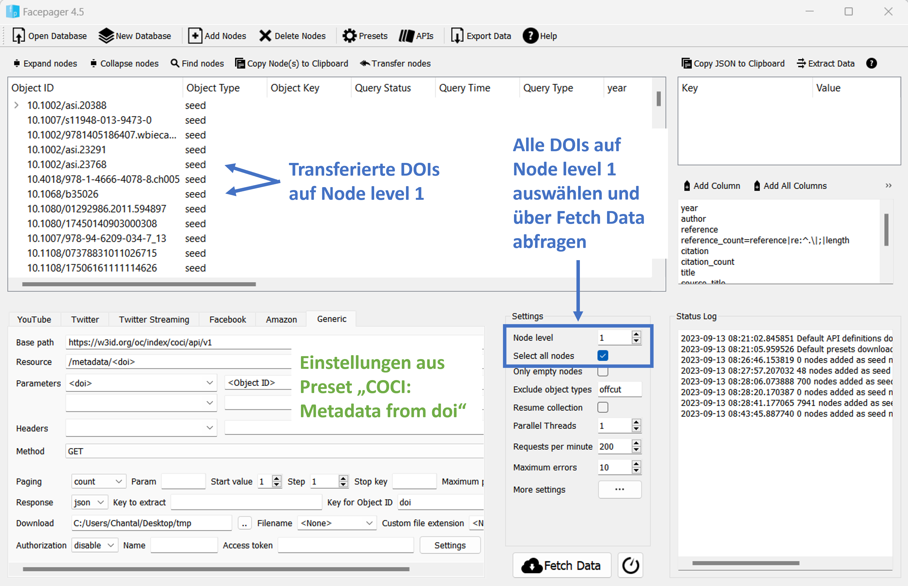
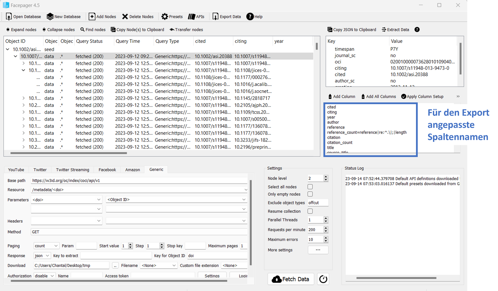

# Konstruktion eines Zitationsnetzwerkes



Publikationen sind ein wesentlicher Output wissenschaftlichen Arbeitens: Indem Forschungsergebnisse zugänglich gemacht werden, konsolidiert sich der aktuelle Forschungsstand. Über Zitationsnetzwerke lässt sich  untersuchen, welche Rolle einzelne Publikationen in der Forschungslandschaft spielen, welche Inhalte sich innerhalb eines Feldes oder auch disziplinübergreifend verbreiten, wie sich Wissensgemeinschaften ausbilden oder auch welchen Einfluss externe Faktoren wie universitäre Zugehörigkeiten auf den Erfolg einer Publikation haben. 
Eine API, um Zitationsdaten zu erheben, bietet Open Citations [OpenCitations API](https://opencitations.net/index/coci/api/v1). Nachfolgend wird beschrieben, wie über die API Zitationsdaten mit Facepager erhoben und in R zu einem Netzwerk aufbereitet und ausgewertet werden. 

Als Startpunkt dient der Aufsatz "Web Crawling Ethics" von M. Thelwall. Um das Netzwerk zu konstruieren, werden zunächst die eindeutigen Digital Object Identifier (=DOI) erhoben, die den Beitrag von Thelwall zitieren. Ausgehend von diesen neu erhobenen DOIs von Publikationen, wird die Datenerhebung in weiteren Wellen wiederholt, um somit die Zitationen von Publikationen in tiefere Ebenen zu verfolgen. Die Zitationen stellen dabei die Kanten dar, welche die Verbindungen zwischen den Publikationen, netzwerkanalytisch Knoten genannt, darstellt. Um die Knoten mit weiteren Inhalten anzureichern, werden in einem zweiten Schritt Metadaten zu den DOIs erhoben, etwa Titel und Autor der Publikation oder auch die zugehörige Disziplin. 

Bei Zitationsnetzwerken handelt es sich um gerichtete Netzwerke, es wird betrachtet in welchen Publikationen ein Startknoten zitiert wird. Die Zitationen werden aus den Referenzen in anderen Publikationen gewonnen. In umgedrehter Richtung könnte auch ein Referenznetzwerk konstruiert werden.


## Datenerhebung mit Facepager 

*Hinweis:* Eine Beispieldatei mit den Ergebnissen der Facepager-Erhebung finden Sie unter [data/citations_export.csv](data/citations_export.csv). Sie können damit bei Bedarf den Erhebungsschritt überspringen und den Datensatz mit den R-Skripten aufbereiten bzw. analysieren.

### Kanten: Crawlen von Zitationen 


**1. Datenbank erstellen:** Zunächst wird mit dem Button ```New Database``` eine neue Facepager-Datenbank angelegt.

**2. Startknoten hinzufügen:** Über ```Add Nodes``` können anschließend die Startknoten für das Crawling des Netzwerks festgelegt werden. In diesem Fall wird die DOI des Artikels ```10.1002/asi.20388``` eingegeben und über den Button ```OK```als Startknoten bestätigt. Anschließend sollte dieser in der ```Nodes View``` unter "Object ID" auftauchen. 

**3. Einstellungen über ein Preset laden:**  Um nun die Zitationen der Publikation zu erhalten, kann der citations-Endpunkt der Open Citations API abgefragt werden. Dieser nimmt als Input eine DOI entgegen und gibt als Output DOIs von Publikationen zurück, die den Startknoten zitieren (und die in der OpenCitations Datenbank aufgeführt sind). Nähere Details zum Endpunkt können [in der Dokumentation auf Open Citations](https://opencitations.net/index/coci/api/v1#/citations/{doi}) nachgeschlagen werden. In Facepager steht ein Preset mit den nötigen Einstellungen bereit. Dafür wählen Sie in der Menüleiste unter ```Presets``` aus der Kategorie  ```Bibliometrics``` das Preset "COCI: citations" aus und übertragen mit einem Klick auf ```Apply```die notwendigen Einstellungen. 

**4. Daten erheben - Welle 1:** Sobald die Einstellungen festgelegt sind, können Sie den Startknoten Auswählen und die Daten durch das Bestätigen von ```Fetch Data``` erheben. In Facepager sollten nun unterhalb des Startknotens die DOIs von Publikationen aufgelistet sein, die den Startknoten zitieren. Im Status-Log können Sie beobachten, wie die URL zum Abfragen des Endpunktes aus den Einstellungen zusammengestellt wird. Geben Sie die URL "https://opencitations.net/index/coci/api/v1/citations/10.1002/asi.20388" einmal im Browser ein und inspizieren Sie den Output! 



**5. Daten inspizieren und Spalten anpassen:** Wenn Sie eine der neu erhobenen DOI anklicken, finden Sie rechts im Data View die erhobenen Daten. Hier sehen Sie beispielsweise im Schlüssel "citing" oder "cited" weitere DOIs - wobei cited der festgelegte Startknoten ist und citing die DOI von der Publikation, welche den Startknoten zitiert. Um diese Daten auch in der Tabelle in der Nodes-View zu sehen und später exportieren zu können, werden die benötigten Schlüssel im Column Setup angegeben. Sobald ein Preset geladen ist, werden auch die Spalten aus diesem Preset übernommen. Sie können die Spalten auch selbst anpassen. Löschen Sie einmal die Bezeichnungen der Schlüssel, beispielsweise "timespan" aus dem Column Setup, bestätigen sie über ```Apply Column Setup``` und beobachten Sie, wie sich die Tabelle verändert. 



**6. Daten erheben - Crawlen weiterer Wellen:** In einer zweiten Erhebungswelle lassen sich nun die Publikationen erheben, die die neu erhobenen DOIs zitieren. Dafür wählen Sie erneut den Startknoten aus, erhöhen das ```Node level```in den Settings auf "2" und klicken auf ```Fetch Data```. Anschließend befindet sich unter jedem Knoten, der in der ersten Erhebungswelle erhoben wurde, erneut eine Liste von DOIs, die diese Publikation zitieren. Dieses sogenannte Crawling von Publikationen können Sie nun für weitere Wellen wiederholen. Wie viele Wellen für die Datenerhebung notwendig sind, hängt vom  Erkenntnissinteresse ab. Da die Anzahl der neuen Startknoten je Welle exponentiell ansteigt, kann die Erhebung tieferer Wellen viel Zeit beanspruchen und man kann dabei an die Limitationen der API stoßen. So werden im Beispiel in der zweiten Erhebungswelle 762 und in der dritten Welle bereits 10.817 neue Knoten erhoben. 


### Knoten: Erheben von Metadaten der Artikel


**1. Transferieren von Knoten:** Da über den API-Endpunkt der Citations noch keine weiteren bibliographischen Daten zu den DOIs erhoben wurden, müssen Angaben wie Autor:in, Jahr oder Titel der Publikation separat abgefragt werden. Durch das Crawling befinden sich die DOIs der Artikel allerdings auf verschiedenen Ebenen - je nachdem, in welcher Welle diese erhoben wurden. Um alle DOIs auf die oberste Ebene (Node level 1) zu ziehen und damit alle gleichzeitig abfragen zu können, bietet Facepager die Funktion ```Transfer Nodes```. Über diese Funktion können Sie für jede Ebene die Knoten auf die oberste Ebene tranferieren, indem Sie sukzessive das Node level eine Ebene hochstellen, jeweils das Häkchen bei ```Transfer all nodes``` setzen und über ```Apply``` bestätigen. Duplikate werden dabei ignoriert. Im Anschluss sollten Sie, wenn Sie den Startknoten für die Erhebung der Kanten einklappen, darunter alle erhobenen DOIs auf der ersten Ebene sehen. 



**2. Metadaten erheben:** Mit dem metadata-Endpunkt der Open-Citations-API können Angaben wie Publikationsjahr, Autor:in oder Titel zu einer DOI erhoben werden. Die dafür notwendigen Einstellungen können über das Facepager-Preset "COCI: Metadata from doi" vorgenommen werden. Sobald Sie das Preset geladen (und die Knoten wie beschrieben auf die oberste Ebene transferiert haben), können Sie in den Settings das ```Node level``` auf 1 Stellen, ```Select all nodes``` auswählen und die Erhebung mittels ```Fetch```starten. 



**3. Export der Daten:** Ist die Erhebung der Zitationen und Metadatan abgeschlossen, exportieren Sie die Daten als CSV-Datei für die Aufbereitung und Analyse mit weiteren Programmen. Wichtig ist zunächst, dass Sie noch einmal die benötigten Spalten in der Tabelle überprüfen und ggf. anpassen. Durch das Laden des Metadata-Presets, sind die Spalten mit den Zitations-Daten aus dem ersten Preset nicht mehr vorhanden. Ergänzen Sie deshalb die Angaben "citing" und "cited" im Column-Setup und betätigen Sie ```Appy Column Setup```. Um nun die Tabelle mit den angepassten Spalten zu abzuspeichern, klicken Sie auf ```Export Data```, wählen den Speicherot und Dateinamen aus und stoßen den Export über ```Save``` an. 


## Datenaufbereitung und Konstruktion des Netzwerkes in R 

Die mit Facepager erhobenen Daten werden anschließend in R eingelesen und aufbereitet. Die einzelnen Schritte für die Konstruktion des Netzwerkgraphs können im R-Skript **[scripts/01_aufbereitung.R](scripts/01_aufbereitung.R)** nachvollzogen werden. Dabei wird aus den erhobenen Daten zunächst eine Kantenliste erstellt, die angibt, welche Publikation (source) in welchen anderen Publikationen (target) zitiert wurde. Anschließend wird eine Knotenliste erstellt, die neben der DOI die Namen der Autor:innen, Titel der Publikation und der Zeitschriften sowie  Publikationsjahr beinhaltet. 

Da sowohl die Angaben zu den Knoten als auch die zu den Kanten in der selben Exportdatei erfasst sind, wird die Spalte "cited" als Unterscheidungskriterium herangezogen: Ist ein Wert in der Spalte vorhanden (die Spalte ist also nicht leer: ```!is.na(cited)```), handelt es sich um eine Zitationsangabe und damit eine Kante. Ist kein Wert in der Spalte vorhanden (die Spalte ist also leer: ```is.na(cited)```), sind keine Zitationsverbindungen in dieser Zeile erfasst, stattdessen sind andere Spalten zu den Metadaten der Knoten befüllt. 

Öffnen Sie das R-Skript und führen Sie es Schritt für Schritt aus, um die Erstellung der Knoten- und Kantenliste nachzuvollziehen.


## Netzwerkanalyse in R 

Sobald Sie eine Knoten- und Kantenliste erstellt haben, können Sie diese in ein Netzwerk umwandeln und auswerten. Im R-Skript **[scripts/02_auswertung.R](scripts/02_auswertung.R)** finden Sie verschiedene Befehle, um das Netzwerk zu analyiseren, die im Buchkapitel erläutert werden. Es werden Maße wie die Dichte berechnet, die das gesamte Netzwerk betreffen oder die Degree-Zentralität, die sich auf die Zentralität einzelner Knoten bezieht. 

Im Skript finden Sie ebenfalls eine Möglichkeit zur Visualisierung des Netzwerks mithilfe des R-Pakets [ggpraph](https://ggraph.data-imaginist.com/index.html).
