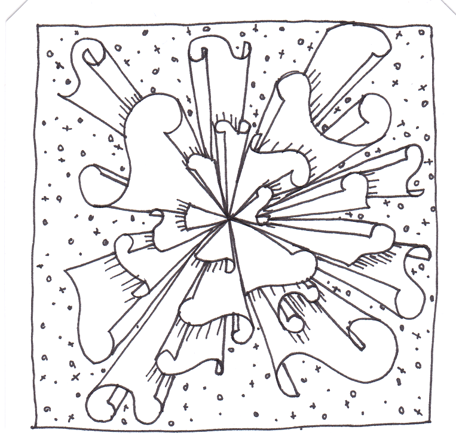

# Netzwerkanalyse

Intuitiv denkt man bei dem Wort "Beziehungen" vielleicht an zwischenmenschliche Beziehungen. Neben Beziehungen zwischen Personen oder auch allgemein Akteuren, die nicht nur direkt sondern auch indirekt über Kookkurrenzen hergestellt werden können, gibt es jedoch noch weitere Arten von Beziehungen: semantische Beziehungen zwischen Wörtern und Konzepten oder auch raumzeitliche Beziehungen zwischen Ereignissen. Sobald Beziehungsdaten vorliegen, können diese als Netzwerk modelliert und analysiert werden. Eine Einführung in die Netzwerkanalyse bietet Kapitel 10 im Lehrbuch.

## Dateien in diesem Ordner
- **[netzwerkanalyse.Rproj](netzwerkanalyse.Rproj)**: R-Projekt für die Beispiele
- **[1_beispielnetzwerk.R](1_beispielnetzwerk.R)**: R-Skript, mit dem die Beispielnetzwerke im Lehrbuch erstellt wurden (Kapitel 10.1)
- **[2_aufbereitung.R](2_aufbereitung.R)**: R-Skript, um ein Netzwerk zu konstruieren. Die Daten, aus denen das Netzwerk gebaut wird, wurden mit Facepager erhoben (Kapitel 10.2).
- **[3_auswertung.R](3_auswertung.R)**: R-Skript mit Funktionen zur Analyse des Netzwerkes (Kapitel 10.3), nachdem mit 2_aufbereitung.R eine Knoten- und eine Kantenliste erstellt wurden.
- **[videos.export.csv](videos.export.csv)**: Die für das Beispiel verwendete, mit Facepager erstellte Datei
