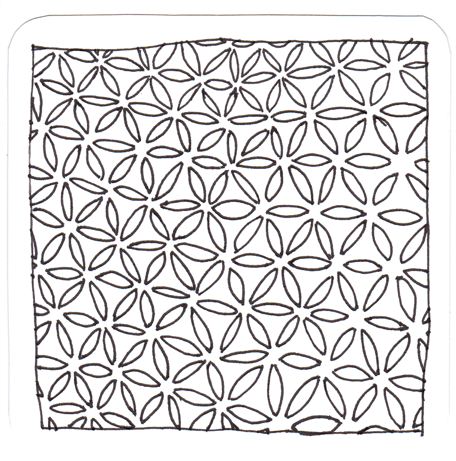
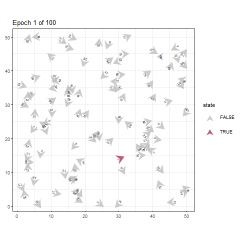
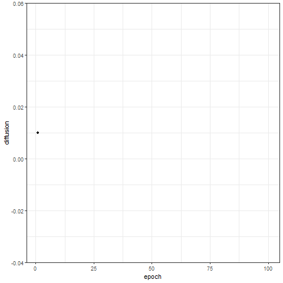

# Computersimulationen

Mit Computersimulationen kann man künstliche Welten erzeugen. Dabei lassen sich gezielt einzelne Faktoren manipulieren,
um unterschiedliche Szenarien zu vergleichen. Die Skripte enthalten ein einfaches Diffusionsmodell, mit dem etwa
die Verbreitung von Desinformationen oder politischen Meinungen simuliert werden kann.

 
 

## Übersicht über Daten und Skripte: 
- **1_simulation_basic.R**: R-Skript mit den Befehlen aus dem Lehrbuch, um eine künstliche Welt aufzubauen und ein Ereignis durchzusimulieren 
- **2_simulation_modul.R**: Modularisierte Version des Skripts 1_simulation_basic.R mit zusätzlichen Funktionen - beispielsweise zur Animation der Simulation
- **simulation.Rproj**: R-Projektdatei
- **diffusion.gif**: Animation von Agenten, die sich in einer künstlichen Welt bewegen
- **trace.gif**: Animation eines Traceplots der Diffusionsrate

