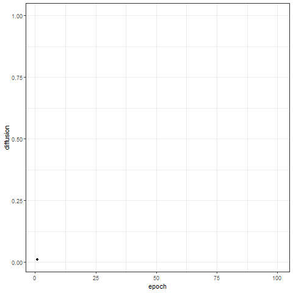

# Computersimulationen

 
 
Computersimulationen erzeugen künstliche Welten (siehe Kapitel 11). Dadurch lassen sich 
Entwicklungen von Ereignissen - etwa die Verbreitung von Desinformationen oder politischen Meinuhngen - beobachten.
Auch der wahrscheinlichste Ausgang ebensolcher Szenarien kann ermittelt werden. 

Einen konzeptionellen und praktischen (mit R) Einsteig in Simulationen bietet Kapitel 11 zum Lehrbuch. 

# Daten und Skripte: 
- 1_simulation_basic.R: R-Skript mit den Befehlen aus dem Lehrbuch, um eine künstliche Welt aufzubauen und ein Ereignis durchzusimulieren 
- 2_simulation_modul.R: Modularisierte Version des Skripts 1_simulation_basic.R mit zusätzlichen Funktionen - beispielsweise zur Animation der Simulation.
- diffusion.gif: Animierung von Akteuren, die sich in künstlicher Welt bewegen. 
- trace.gif: Animierte Entwicklung des Trace Plots.

