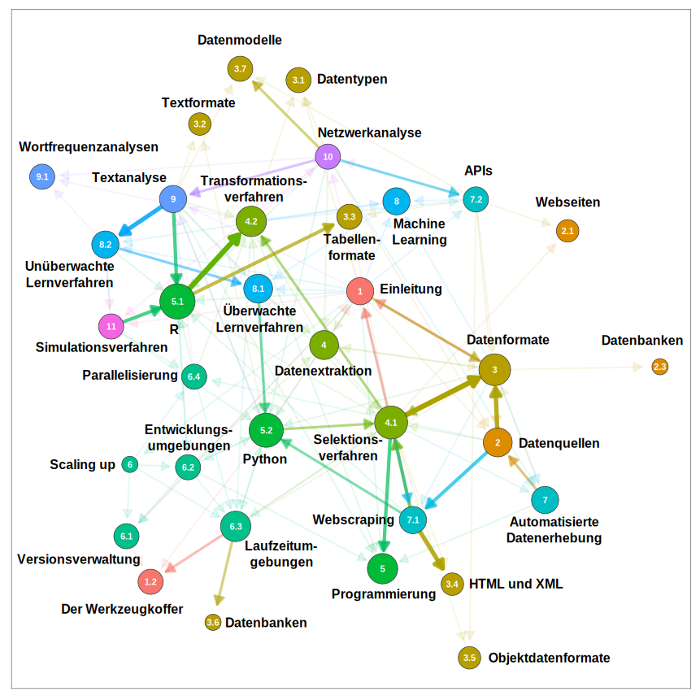

# Zusammenfassung

Computational Methods bringen eine spezielle Perspektive auf die Welt mit
sich. Betrachtet man die Verweise zwischen den Kapiteln des Lehrbuchs als Netzwerk, 
dann ergibt sich zum einen ein buntes Bild und zum anderen lassen sich Lesepfade erkennen.

Um eine solche Netzwerkgrafik aus Texten zu erzeugen, empfehlen wir als Einstieg die Programmiersprache R (Kapitel 5.1), dann eine Beschäftigung mit Datenformaten (Kapitel 3.4; Word-Dokumente bestehen zum Beispiel aus XML) und Textanalysen (Kapitel 9). Schließlich finden Sie im Kapitel zur Netzwerkanalyse (Kapitel 10) eine Anleitung zum Erstellen von Grafiken. Spätestens wenn Sie diese Themen nachvollzogen haben, sind Sie in der Welt
der Computational Methods angekommen.

 